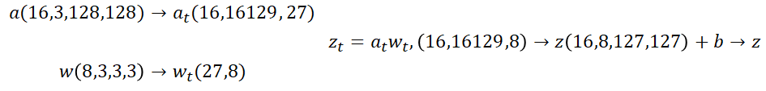
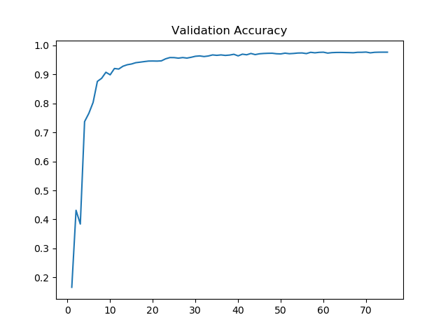

# 卷积神经网络公式推导及numpy实现

本文主要侧重于网络的代码实现，具体的公式推导可参考：https://zhuanlan.zhihu.com/p/61898234

完整代码：https://github.com/hui126/Deep_Learning_Coding/blob/main/Conv.py

卷积神经网络可以看作是感知机网络的拓展，神经元的数目等于图像的通道数，输入到网络中的值由向量变为张量，与感知机网络最大的不同在于使用权值共享，即每一通道卷积运算过程中共享使用一个卷积核。

## 前向传递

基于numpy，假设输入特征图$a$维度为$(1,3,4,4)$，卷积核$w$的维度为$(2, 3, 2, 2)$，步长为$(1, 1)$，
$$
a[0,0,:,:] = \left[\begin{matrix}
1 & 6 & 6 & 2 \\ 4 & 3 & 4 & 3 \\ 3 & 6 & 7 & 7 \\ 1 & 5 & 1 & 2
\end{matrix}\right], a[0,1,:,:] = \left[\begin{matrix}
9 & 1 & 6 & 7 \\ 5 & 3 & 2 & 6 \\ 5 & 7 & 1 & 7 \\ 6 & 8 & 5 & 8
\end{matrix}\right], a[0,2,:,:] = \left[\begin{matrix}
8 & 6& 9 & 5 \\ 4 & 6 & 1 & 6 \\ 2 & 3 & 3 & 8 \\ 3 & 5 & 3 & 6
\end{matrix}\right]
$$
卷积核为
$$
w[0,0,:,:] = \left[\begin{matrix} 5 & 9 \\ 5 & 8\end{matrix}\right],
w[0,1,:,:] = \left[\begin{matrix} 1 & 1 \\ 8 & 8\end{matrix}\right], w[0,2,:,:] = \left[\begin{matrix} 7 & 1 \\ 2 & 8\end{matrix}\right] \\
w[1,0,:,:] = \left[\begin{matrix} 5 & 6 \\ 9 & 3\end{matrix}\right],
w[1,1,:,:] = \left[\begin{matrix} 2 & 1 \\ 9 & 1\end{matrix}\right], w[1,2,:,:] = \left[\begin{matrix} 8 & 4 \\ 3 & 6\end{matrix}\right]
$$
偏置系数为$b=[1, 2]$

则输出特征图为
$$
z[i,j,:,:] = \sum^{2}_{k=0}a[i,k,:,:]*w[j,k,:,:] + b[j]
$$
结果为：
$$
z[0,0,:,:] = \left[\begin{matrix}
296 & 250 & 288 \\ 277 & 280 & 294\\ 302 & 297 & 315
\end{matrix}\right], z[0,1,:,:] = \left[\begin{matrix}
291 & 252 & 263 \\ 230 & 267 & 239 \\ 223 & 283 & 257
\end{matrix}\right]
$$
为了便于梯度反向传播计算，我们将对卷积核与输入特征图进行变换，将卷积运算转化为矩阵乘法运算，其中卷积核转为$(3*2*2,2)$的矩阵，
$$
w_t = w.reshape(-1,2).T= \left[\begin{matrix}
5&9&5&8&1&1&8&8&7&1&2&8\\ 5&6&9&3&2&1&9&1&8&4&3&6
\end{matrix}\right]^T
$$
输入特征图转为$(1,9,12)$的矩阵，
$$
a_t[0]=\left[\begin{matrix}
1& 6& 4& 3& 9& 1& 5& 3& 8& 6& 4& 6 \\
6& 6& 3& 4& 1& 6& 3& 2& 6& 9& 6& 1\\
6& 2& 4& 3& 6& 7& 2& 6& 9& 5& 1& 6\\
4& 3& 3& 6& 5& 3& 5& 7& 4& 6& 2& 3\\
3& 4& 6& 7& 3& 2& 7& 1& 6& 1& 3& 3\\
4& 3& 7& 7& 2& 6& 1& 7& 1& 6& 3& 8\\
3& 6& 1& 5& 5& 7& 6& 8& 2& 3& 3& 5\\
6& 7& 5& 1& 7& 1& 8& 5& 3& 3& 5& 3\\
7& 7& 1& 2& 1& 7& 5& 8& 3& 8& 3& 6
\end{matrix}\right]\\
$$
则$z_t[0] = a_t[0]w_t$，其中$z_t[0]$的每一列对应于卷积输出的第一张特征图的每一个通道的值，所以$z=z_t.transpose([0, 2, 1]).rehsape(1,2,3,3)+b$

---

符号约定：假设每一层的神经元数目（输出特征图通道数）为$n^l$，共$L$层，其中$n^0$为输入图像的通道数目。

$a^{l-1}$	第$l$层卷积层的输入特征图，维度为$(B,C^{l-1},H^{l-1},W^{l-1})$；

$z^l$	    卷积输出结果，未经过激活函数，维度为$(B,C^l,H^l,W^l)$

$h(z)$	激活函数；

$w^l$	   卷积核，维度为$(C^{l}, C^{l-1}, h^l, w^l)$；

$b^l$ 	   偏置系数，维度为$(C^l,)$

卷积输出结果为，
$$
z^{l}[i,j,:,:] = \sum^{C^{l-1}-1}_{k=0}a^{l-1}[i,k,:,:]*w^l[j,k,:,:] + b^l[j] \quad i=0,\cdots,B-1,j=0,\cdots,C^l-1
$$
将卷积处理过程转化为矩阵乘积，
$$
a_t^{l-1} = trans(a^{l-1}), dim=(B, H^l\cdot W^l,h^l\cdot w^l\cdot C^{l-1})
$$
其中$trans(a^{l-1})$为将每一个卷积核停留处的对应数值展成一行，存储在$a^{l-1}_t$中。
$$
w_t = w.reshape(-1, C^l).T
$$

$$
z_t^l = a^{l-1}_tw_t \\ 
z^l = z_t^l.transpose([0, 2, 1]).reshape(B, C^l, H^l,W^l)+b.reshape(1, -1, 1, 1)
$$

```python
def forward(self, inputs):
    inputs = self.pad(inputs)
    self.input_shape = inputs.shape
    self.batch_size, in_channels, self.H_in, self.W_in = inputs.shape
    assert in_channels == self.in_channels, 'inputs dim1({}) is not equal to convolutional in_channels({})'.format(in_channels, self.in_channels)

    self.H_out = (inputs.shape[2] - self.kernel_size[0]) // self.stride[0] + 1
    self.W_out = (inputs.shape[3] - self.kernel_size[1]) // self.stride[1] + 1

    self.input_trans = np.empty((self.batch_size, self.H_out * self.W_out, self.kernel_trans.shape[0]))

    ind = 0
    h = 0
    while (h + self.kernel_size[0] <= inputs.shape[2]):
        w = 0
        while (w + self.kernel_size[1] <= inputs.shape[3]):
            self.input_trans[:, ind, :] = inputs[:, :, h:h + self.kernel_size[0], w:w + self.kernel_size[1]].reshape(self.batch_size, -1)
            w += self.stride[1]
            ind += 1
            h += self.stride[0]

            output = self.input_trans @ self.kernel_trans
            output = output.transpose([0, 2, 1]).reshape(self.batch_size, self.out_channels, self.H_out, self.W_out)
            if self.bias is not None:
                output += self.bias.reshape(1, -1, 1, 1)
	return self.input_trans, output
```

## 反向传播

与全连接层类似，在进行梯度反向传播过程中，计算损失函数对$z^l$的反向传播误差，然后再计算对卷积核及偏置的导数。

假设输入特征图为
$$
a = \left[\begin{matrix} a_{11}&a_{12}&a_{13}&a_{14} \\a_{21}&a_{22}&a_{23}&a_{24} \\a_{31}&a_{32}&a_{33}&a_{34}\\a_{41}&a_{42}&a_{43}&a_{44}\end{matrix}\right]
$$
卷积核为
$$
w = \left[\begin{matrix}w_{11}&w_{12}\\w_{21}&w_{22}\end{matrix}\right]
$$
卷积步长为$(1,1)$，损失函数对卷积结果的反向传播误差为：
$$
\delta = \left[\begin{matrix} \delta_{11}&\delta_{12}&\delta_{13} \\ \delta_{21}&\delta_{22}&\delta_{23} \\\delta_{31}&\delta_{32}&\delta_{33} \end{matrix}\right]
$$
则损失函数对输入特征图的梯度为：
$$
\left[\begin{matrix}
w_{11}\delta_{11} & w_{11}\delta_{12}+w_{12}\delta_{11}& w_{12}\delta_{12}+w_{11}\delta_{13}& w_{12}\delta_{13} \\
w_{21}\delta_{11}+w_{11}\delta_{21}& w_{22}\delta_{11}+w_{21}\delta_{12}+w_{12}\delta_{21}+w_{11}\delta_{22}& w_{22}\delta_{12}+w_{21}\delta_{13}+w_{12}\delta_{22}+w_{11}\delta_{23}&
w_{21}\delta_{13}+w_{11}\delta_{23} \\
w_{21}\delta_{21}+w_{11}\delta_{31}& w_{22}\delta_{21}+w_{21}\delta_{22}+w_{12}\delta_{31}+w_{11}\delta_{32}& w_{22}\delta_{22}+w_{21}\delta_{23}+w_{12}\delta_{32}+w_{11}\delta_{33}&
w_{21}\delta_{23}+w_{11}\delta_{33} \\
w_{21}\delta_{31} & w_{22}\delta_{31}+w_{21}\delta_{32}& w_{22}\delta_{32}+w_{21}\delta_{33}& w_{22}\delta_{33}
\end{matrix}\right]
$$
即将对输出图的误差进行0填充后，与卷积核旋转180度后进行卷积，即获得损失函数对输入特征图的误差。

所以当已知$\delta^{l+1}$时，计算$\delta^l$，
$$
\delta^l = \delta^{l+1}*ROT180(w^{l+1})\odot \frac{\partial a^l}{\partial z^l}
$$

---

在这里同样换一种思路，根据上一小节的转换后的前向传播公式，我们可以计算损失函数对$a^{l-1}_t$的反向传播误差，然后将结果转为对应的$a^{l-1}$。已知$\delta^l$，
$$
\delta^l_t = \delta^l.transpose([0, 2, 3, 1]).reshape(B, H^l\cdot W^l,C^l)\\
$$
计算$\delta^l_t,dim=(B,H^lW^l,C^l)$与$(w^l_t)^T,dim=(C^l,C^{l-1}h^lw^l)$的张量乘积即可获得损失函数对$a^{l-1}_t$的梯度信息。
$$
\frac{\partial C}{\partial a^{l-1}_t} = np.tensordot(\delta^l_t,(w^l_t)^T, [(2),(0)])
$$
其中$[(2),(0)]$表示对$\delta^l_t$的第3维度和$(w^l_t)^T$的第1维度进行计算，结果的维度为$(B,H^l,W^l, C^{l-1}h^lw^l)$。

将获得中间误差信息反向变换（映射到同一位置处执行加法运算）可以获得损失函数对$a^{l-1}$的梯度。

```python
def backward(self, grad):
	grad_trans = grad.transpose([0, 2, 3, 1]).reshape(self.batch_size, -1, self.out_channels)
	grad_backward_trans = np.tensordot(grad_trans, self.kernel_trans.T, [(2), [0]])
	grad_backward = np.zeros(self.input_shape)

	ind = 0
	for ih in range(grad.shape[2]):
		begin_h = ih * self.stride[0]
		for iw in range(grad.shape[3]):
			begin_w = iw * self.stride[1]
			grad_backward[:, :, begin_h:(begin_h+self.kernel_size[0]), begin_w:(begin_w+self.kernel_size[1])] += \
			grad_backward_trans[:, ind, :].reshape(self.batch_size, self.in_channels, self.kernel_size[0], self.kernel_size[1])
			ind += 1
	grad_backward = grad_backward[:, :, self.padding[0]:self.input_shape[2]-self.padding[0], self.padding[1]:self.input_shape[3]-self.padding[1]]
	# print(grad_backward.shape)

	self.grad_k_trans = np.tensordot(self.input_trans, grad_trans, [(0, 1), (0, 1)])
	if self.bias is not None:
		self.grad_b = np.sum(grad_trans, axis=(0, 1)).reshape(1, -1)
	return grad_backward
```

已知$\delta^l_t$时，计算损失函数对$w^l_t,b^l$的梯度，
$$
\frac{\partial C}{\partial w^l_t} = np.tensordot(a^{l-1}_t,\delta^l_t,[(0,1),(0,1)]) \\
\frac{\partial C}{\partial b^l} = np.sum(\delta^l_t, axis=(0,1))
$$
对于最大池化，可以利用相近的思想进行处理。

假设输入特征图$a$维度为$(16, 3, 128, 128)$，卷积核$w$为$(8, 3, 3, 3)$，偏置$b$为$(8)$步长为$(1,1)$，不进行填充，则前向传播过程为：



获得输出特征图的反向传播误差$\delta(16, 8, 127,127)$后，计算对输入特征图的反向传播误差，
$$
𝛿(16,3,127,127)→𝛿_𝑡 (16,16129, 8)→𝛿_𝑡^′=𝛿_𝑡 𝑤_𝑡^𝑇,(16,16129,27)→𝛿′(16,3,128,128)
$$
对mnist数据集进行分类，构建网络结构如下：

```python
layers = [Conv2d(in_channels=1, out_channels=6, kernel_size=(5, 5), stride=(1, 1), padding=(2, 2)),
          MaxPool2d(kernel_size=(2, 2), stride=(2, 2)),
          ReLU(),
          Conv2d(in_channels=6, out_channels=16, kernel_size=(5, 5), stride=(1, 1), padding=(2, 2)),
          MaxPool2d(kernel_size=(2, 2), stride=(2, 2)),
          ReLU(),
          Flatten(),
          Linear(in_features=784, out_features=120),
          ReLU(),
          Linear(in_features=120, out_features=10)]
```

使用随机梯度下降进行梯度更新，完成5轮训练，训练损失变化曲线为


验证准确率变化曲线为：



测试集准确率为0.9798。

> github：https://github.com/hui126/Deep_Learning_Coding
