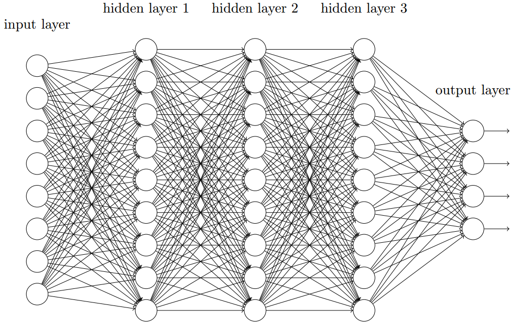
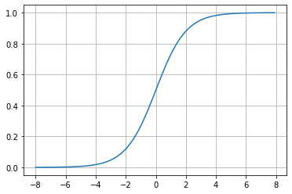
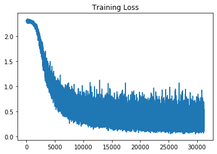
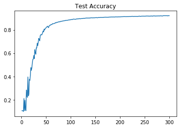

[toc]

# 全连接神经网络公式推导及numpy实现



全连接神经网络由**输入层、隐藏层和输出层**组成，隐藏层通常有多层，输出层神经元数目与具体任务有关。使用激活函数进行非线性化，增强网络的拟合表征能力，常见的激活函数有ReLU、Sigmoid及Softmax等。本文将推导全连接网络的前向及反向传播公式，并使用numpy进行手动编程实现对mnist数据集的分类。

## 1. 预备知识

### 1.1 链导法则

使用梯度反向传播算法进行网络梯度的更新，此时需要应用链导法则进行求解梯度信息。梯度在反向传播过程中只向与其有联系的变量进行传递，例如，前向传递时A影响了B，那么反向传递时B的梯度信息将传递给A。设函数为$w=f(u,v),u=g(t),v=h(t)$，则$w$对$t$的梯度为：
$$
\frac{dw}{dt}=\frac{\partial w}{\partial u}\cdot\frac{\partial u}{\partial t}+\frac{\partial w}{\partial v}\cdot\frac{\partial v}{\partial t}
$$

### 1.2 Sigmoid激活函数



函数公式为
$$
f(z)=\frac{1}{1+e^{-z}}
$$
其导数公式为
$$
f'(z)=\frac{e^{-z}}{(1+e^{-z})^2}=f(z)[1-f(z)]
$$

### 1.3 Softmax激活函数

Softmax函数能够将输入向量转化为概率，常与交叉熵损失共同使用并用于分类分类任务中，其函数公式为
$$
f(x_i) = \frac{e^{x_i}}{\sum^n_{j=1}e^{x_j}}
$$
对$x_k$求导，分两种情况，当$k=i$时，
$$
\frac{\partial f(x_i)}{\partial{x_k}}=\frac{e^{x_i}\sum^n_{j=1}e^{x_j}-e^{x_i}e^{x_k}}{(\sum^n_{j=1}e^{x_j})^2} = \frac{e^{x_i}}{\sum^n_{j=1}e^{x_j}}\cdot \frac{\sum^n_{j=1}e^{x_j}-e^{x_k}}{\sum^n_{j=1}e^{x_j}} = f(x_i)[1-f(x_k)]
$$
当$k\ne i$时，
$$
\frac{\partial f(x_i)}{\partial x_k} = \frac{-e^{x_i}e^{x_k}}{(\sum^n_{j=1}e^{x_j})^2}=-f(x_i)f(x_k)
$$
则
$$
\frac{\partial f(x)}{\partial x} = 
\left[\begin{matrix}
f(x_1)[1-f(x_1)] & -f(x_1)f(x_2) & \cdots & -f(x_1)f(x_n) \\
-f(x_2)f(x_1) & f(x_2)[1-f(x_2)] & \cdots & -f(x_2)f(x_n) \\
\vdots & \vdots & \ddots & \vdots \\
-f(x_n)f(x_1) & -f(x_n)f(x_2) & \cdots & f(x_n)[1-f(x_n)] 
\end{matrix}\right]
$$

### 1.4 交叉熵损失

交叉熵可以用来计算两个分布之间的距离，在分类任务中衡量预测结果与标签值之间的差异，
$$
H(p,q) = -\sum_x p(x)\log q(x)
$$
其中$p$为标签值，$q$为预测值。


## 2. 前向传播

符号约定，上标$l$表示与第$l$层网络相关的数据，共$L$层，输入层记为$0$，输出层记为$L$，下标表示矩阵或向量索引。

$x$		  网络输入，维度为$(1, n^0)$；

$n^l$		表示第$l$层神经元数目；

$h(z)$	表示激活函数；

$z^l$		表示第$l$层的未激活值，维度为$(1, n^l)$；

$a^l$		表示第$l$层经过激活函数后的值，维度为$(1, n^l)$；

$W^l$	  表示第$l$层网络权值矩阵，维度为$(n^{l-1},n^l)$；

$b^l$		 表示第$l$层网络偏置，维度为$(1,n^l)$；

将输入$x$记为$a^0$，则对于第$l$层网络，其输入数据为$a^{l-1}$，输出数据为$a^{l}$，**前向传播公式**为
$$
z^l = a^{l-1}W^l + b^l\\
a^l = h(z^l)
$$
按顺序计算$z^l,a^l$，即$a^0\to z^1\to a^1\to \cdots\to z^L\to a^L$。

获得输出层$a^L$后，在训练阶段时，计算损失函数，
$$
C(a^L,y) = -\sum_{i=1}^{n^L} y_i\log a^L_i
$$
在测试阶段时，根据$a^L$得到预测分类类别
$$
\hat y = \mathop{\arg\max}_{i\in\{1,\cdots,n^L\}} a^L
$$

## 3. 梯度反向传播

使用损失计算网络参数的梯度并更新参数。定义反向传播误差$\delta^l$为损失函数对第$l$层未激活输出$z^l$的梯度，即
$$
\delta^l = \frac{\partial C}{\partial z^l}
$$
首先计算输出层的反向传播误差$\delta^L$，根据1.3节可得
$$
\begin{aligned}
\delta^L_j &= \frac{\partial C}{\partial z^L_j} \\
&= -\sum^{n^L}_{i=1} \frac{y_i}{a^L_i}\frac{\partial a^L_i}{\partial z^L_j}\\
&= -\frac{y_j}{a^L_j}[a^L_j(1-a^L_j)] + \sum^{n^L}_{i\ne j}\frac{y_i}{a^L_i}(a^L_i a^L_j) \\
&= -y_j(1-a^L_j) + \sum^{n^L}_{i\ne j}y_i a^L_j \\
&= -y_j + a^L_j \sum^{n^L}_{i=1}y_i \\
&= a^L_j - y_i
\end{aligned}
$$
所以输出层得反向传播误差为
$$
\delta^L = a^L - y
$$
由第$l+1$层得反向传播误差$\delta^{l+1}$推导第$l$层得反向传播误差$\delta^l$，由链导法则可知
$$
\delta^l = \frac{\partial C}{\partial z^l} = \frac{\partial C}{\partial z^{l+1}} \frac{\partial z^{l+1}}{\partial a^{l}} \frac{\partial a^l}{\partial z^l}
$$
由前向传播公式可知，
$$
z^{l+1}_j = a^l W^{l+1}_{:,j} + b^{l+1}_j\\
\frac{\partial z^{l+1}_j}{\partial a^l} = (W^{l+1}_{:,j})^T\\
\frac{\partial a^l}{\partial z^l} = h'(z^l)
$$
所以$\delta^l$为
$$
\delta^l = \sum^{n^{l+1}}_{j=1} \frac{\partial C}{\partial z^{l+1}_j} \frac{\partial z^{l+1}_j}{\partial a^{l}} \frac{\partial a^l}{\partial z^l} = \sum^{n^{l+1}}_{j=1}\delta^{l+1}_j \cdot (W^{l+1}_{:,j})^T \odot h'(z^l) = \delta^{l+1} (W^{l+1})^T \odot h'(z^l)
$$
对第$l$层的权值矩阵$W^l$和偏置$b^l$求导，
$$
\frac{\partial C}{\partial W^l_{i,j}} = \sum_{j=1}^{n^l}\frac{\partial C}{\partial z^{l}_j}\frac{\partial z^l}{\partial W^l_{i,j}} = \delta^l_j a^{l-1}_i \Rightarrow \frac{\partial C}{\partial W^l} = (a^{l-1})^T\delta^l \\
\frac{\partial C}{\partial b^l} = \frac{\partial C}{\partial z^l}\frac{\partial z^l}{\partial b^l} = \delta^l
$$
获得训练参数得梯度信息后使用梯度下降法更新网络参数：
$$
W^l \leftarrow W^l - \eta \frac{\partial C}{\partial W^l}\\
b^l \leftarrow b^l - \eta \frac{\partial C}{\partial b^l}
$$

## 4. 训练流程

1. 初始化网络参数，包括权值矩阵、偏置、训练迭代次数、batch大小即学习率$\eta$。

2. 从训练数据中获取batch_size条训练数据$X_{(m, n^0)},y_{(m,n^0)}$。

3. 前向传播：
   $$
   Z^l = A^{l-1}W^l + b^l\\
   A^l = h(Z^l)
   $$

4. 计算损失值：
   $$
   L(A^L,y) = \frac 1 m \sum^m_{i=1}C(A^l_{i,:}, y_{i,:})
   $$

5. 进行反向传播：
   $$
   \Delta^L=\frac 1 m (A^L - y) \\
   \Delta^l = \Delta^{l+1} (W^{l+1})^T \odot h'(Z^l)\\
    \frac{\partial L}{\partial W^l} = (A^{l-1})^T\Delta^l \\
   \frac{\partial C}{\partial b^l} = \boldsymbol 1_{(1, m)}\delta^l
   $$

6. 梯度更新：
   $$
   W^l \leftarrow W^l - \eta \frac{\partial L}{\partial W^l}\\
   b^l \leftarrow b^l - \eta \frac{\partial L}{\partial b^l}
   $$
   重复2-6进行迭代训练。

## 5. 代码实现

```
git clone https://github.com/hui126/Deep_Learning_Coding.git
cd Deep_Learning_Coding
python mlp.py
```

对[mnist](http://deeplearning.net/data/mnist/mnist.pkl.gz)数据集进行分类，构建一个两层神经网络，神经元数目分别为100，10。batch_size为32，学习率为0.01，共训练20轮。

训练损失变化曲线



验证准确率变化曲线



完成训练后，测试集准确率为0.9179。