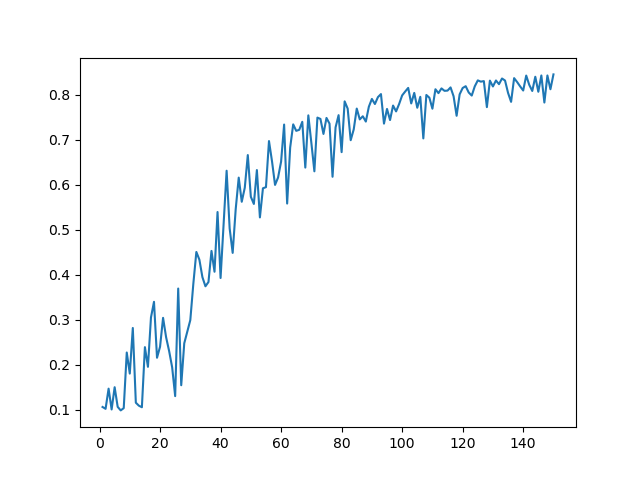
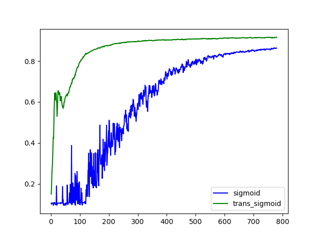

考虑$L$层的多层感知机模型(MLP)，忽略偏置信息，第$l$层的前向传递为，
$$
z^l = a^{l-1} W^l,\quad a^l = \sigma(z^l)\\
$$
计算第$l$层的反向传递误差，
$$
\begin{aligned}
\frac{\partial L}{\partial z^l} 
&= \frac{\partial L}{\partial z^L}\frac{\partial z^L}{\partial z^{L-1}}\cdots\frac{z^{l+1}}{\partial z^l}\\
&= \delta^L (W^L)^T diag(\sigma'(z^{L-1}))\cdots (W^{l+1})^T diag(\sigma'(z^l))\\
&= \delta^L\prod^{l+1}_{i=L} (W^i)^T diag(\sigma'(z^{i-1}))
\end{aligned}
$$
无论是前向传递还是反向传递过程，都是在不断地进行矩阵乘法运算，当网络的层数很大时，计算的梯度值可能会很大或很小，超出数值精度，直接导致梯度爆炸或梯度消失，使得网络参数无法更新，训练过程崩溃。

出现梯度爆炸时，训练对学习率的选取很敏感，过大将会产生更大的梯度，过小梯度更新缓慢，需要在训练过程重不断调整学习率；出现梯度消失时，不管如何选择学习率，训练都无法进行下去，在底层网络会更容易出现，尤其是使用Sigmoid激活函数时。

为了避免出现上诉问题，让训练过程更加稳定，需要将网络权值控制在合理的范围内，如，

- 将乘法变为加法，如ResNet，能够搭建很深的网络
- 进行归一化，使用梯度归一化，梯度裁剪等
- 选择合理的权值初始化和激活函数

合理的权值初始化即控制每一层的输出与梯度大小，让它们的均值和方差保持一致。即对任意一层$l$，有
$$
\mathbb E[z^l_i] = 0,Var[z^l_i] = a\\
\mathbb E[\frac{\partial L}{\partial z^l_i}] = 0, Var[\frac{\partial L}{\partial z^l_i}] = b
$$
其中$a,b$均为常数。

假设每一层的输入与网络权值满足，

- 权值$w^l_{i,j}$是独立同分布，且$\mathbb E[w^l_{i,j}]=0,Var[w^l_{i,j}]=\gamma_l$
- 输入$a^{l-1}_i$与$w^l_{i,j}$相互独立。

当不考虑激活函数时，$a^l=z^l$，正向均值为：
$$
\mathbb E[z^l_j] = \mathbb E[\sum_{i}z^{l-1}_i w^l_{i,j}]=\sum_j\mathbb E[z^{l-1}_i]\mathbb E[w^l_{i,j}]=0
$$
正向方差为：
$$
\begin{aligned}
Var[z^l_j] 
&= \mathbb E[(z^l_j)^2]-\mathbb E[z^l_j]^2 \\
&= \mathbb E[(\sum_{i}z^{l-1}_i w^l_{i,j})^2] \\
&= \mathbb E[\sum_i (z^{l-1}_i)^2(w^l_{i,j})^2 + \sum_{i\ne k}z^{l-1}_iw^l_{i,j}z^{l-1}_kw^l_{k,j}]\\
&= \sum_i \mathbb E[(z^{l-1}_i)^2]\mathbb E[(w^l_{i,j})^2]\\
&= n^{l-1}\gamma_l Var[z^{l-1}_i]
\end{aligned}
$$
同理，反向均值为：
$$
\mathbb E[\frac{\partial L}{\partial z^{l-1}_i}] = \mathbb E[\sum_j \delta^l_j w^l_{i, j}] = \sum_j\mathbb E[\delta^l_j] \mathbb E[w^l_{i,j}] = 0
$$
反向方差为：
$$
\begin{aligned}
Var[\frac{\partial L}{\partial z^{l-1}_i}] &= \mathbb E[(\frac{\partial L}{\partial z^{l-1}_i})^2]-\mathbb E[\frac{\partial L}{\partial z^{l-1}_i}]^2 \\
&= \mathbb E[(\sum_{j}\delta^l_j w^l_{i,j})^2] \\
&= \mathbb E[\sum_j (\delta^l_j)^2(w^l_{i,j})^2 + \sum_{j\ne k} \delta^l_j w^l_{i,j} \delta^l_k w^l_{i,k}]\\
&= \sum_j \mathbb E[(\delta^l_j)^2]\mathbb E[(w^l_{i,j})^2]\\
&= n^{l}\gamma_l Var[\delta^l_j]
\end{aligned}
$$
要让每一层的输出和梯度分别保持一致，即
$$
Var[z^l_j]= n^{l-1}\gamma_l Var[z^{l-1}_i],\quad Var[\delta^{l-1}_i]=n^{l}\gamma_l Var[\delta^l_j]
$$
则需要满足
$$
n^{l-1}\gamma_l = 1\\
n_l \gamma_l = 1
$$
由于$n^l$与$n^{l-1}$并不一定相等，所以上述条件通常难以满足。

Xaiver初始化要求$\gamma_l(n^l+n^{l-1})/2 = 1$，即$\gamma_t = \frac{2}{n^l+n^{l-1}}$，网络权值的方差为输入维度和输出维度均值的倒数。

- 正态分布$\mathcal N(0,\sqrt{\frac{2}{n^l+n^{l-1}}})$，
- 均匀分布$\mathcal U(-\sqrt{\frac{6}{n^l+n^{l-1}}},\sqrt{\frac{6}{n^l+n^{l-1}}})$

当构建5层的MLP时，若将权重随机初始化到-0.01到0.01之间时，此时网络权重无法有效更新，采用Xavier初始化，验证准确率变化如下：

当使用线性激活函数$\sigma(x) = \alpha x+\beta$时，
$$
\mathbb E[a^l_i] = \mathbb E[\alpha z^l_i+\beta] = \alpha \mathbb E[z^l_i] + \beta = \beta
$$

$$
\begin{aligned}
Var[a^l_i] &= \mathbb E[(a^l_i)^2] - \mathbb E[a^l_i]^2\\
&=  \mathbb E[(\alpha z^l_i + \beta)^2] - \beta^2\\
&= \mathbb E[\alpha^2 (z^l_i)^2+2\alpha\beta z^l_i+\beta^2] - \beta^2\\
&= \alpha^2Var[z^l_i]
\end{aligned}
$$

由此可知$\alpha = 1, \beta = 0$。同理，反向传播公式推导也可得到$\alpha=1,\beta=0$。即激活函数在0附近要尽量趋于线性函数。

对常见的激活函数进行泰勒展开，
$$
sigmoid(x) = \frac{1}{2} + \frac{x}{4} - \frac{x^3}{48} + O(x^5)\\
tanh(x) = x - \frac{x^3}{3} + O(x^5)\\
relu(x) = x \quad x>0
$$
为了使得Sigmoid函数在0附近趋于线性，调整为$4\times sigmoid(x)-2$。

构建一个两层的MLP，对mnist数据集进行分类，比较原sigmoid函数变换sigmoid函数之间的验证准确率变化趋势，由图可知，变换后的sigmoid函数能够提高训练速度，降低饱和导致的梯度消失。

